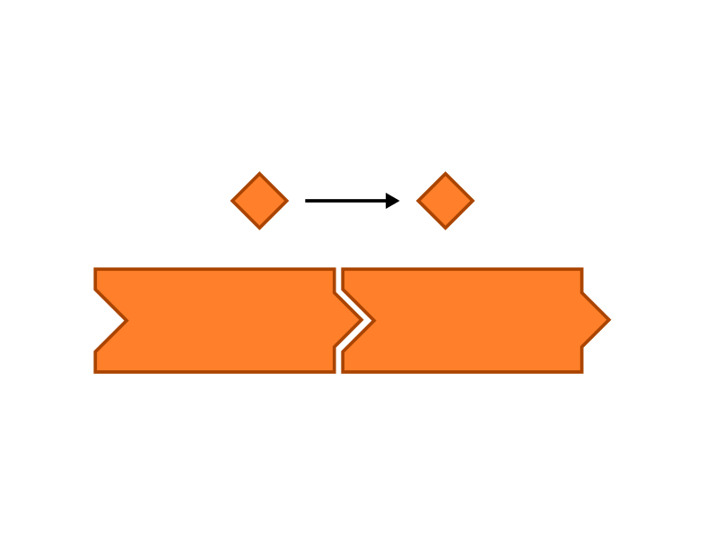
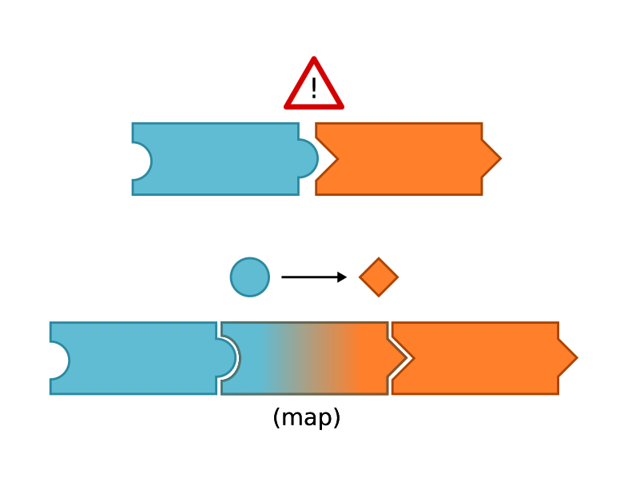
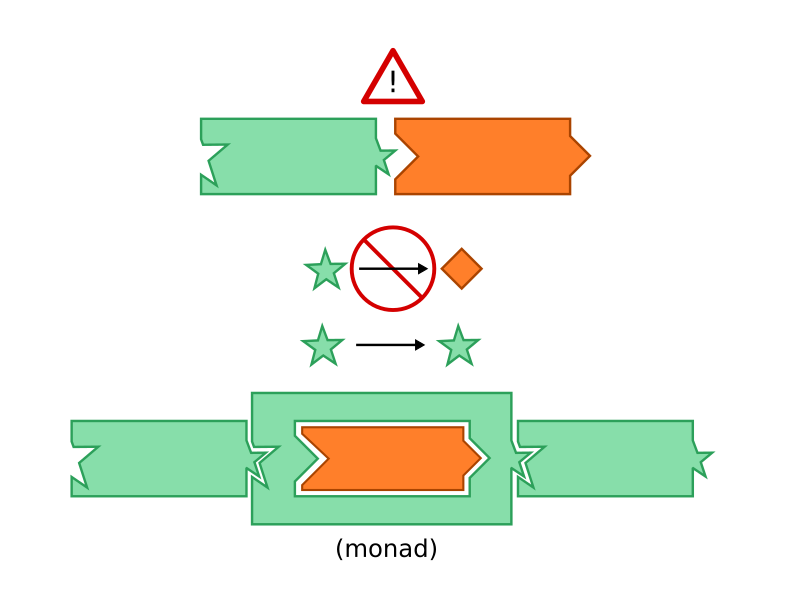

That's Monad-wang!
==============================

Notes:
- People who know me know I'm obsessed with functional languages
- Lately I've been fascinated with monads
  - Pinnacle of obscure functional programming concepts
  - Really are fascinating in what they can do for your program


## Goals

1. Give a taste of what monads look like and what they do
2. Use a silly example to demonstrate a monad
3. Blow your mind / make your brain hurt / confuse you / delight and amuse you

Notes:
- The traditional  monadic rite of passage is to present your own monad tutorial, so here I am adding to the universal canon of monad explanations


## Non-goals

1. Satisfactorily / accurately / completely explain monads
2. Demonstrate understanding of monads
3. Demonstrate understanding of anything


## Monads

Monads are a design pattern to add "power-ups" to a value

Example: The "numberwang monad" - just a number, but with the "power-up" that it might also be numberwang
<!-- .element: class="fragment" -->


## WTF is Numberwang?

Numberwang is a British game show parody that follows concealed rules (wink, wink, like a monad):

<iframe width="560" height="315" src="https://www.youtube.com/embed/qjOZtWZ56lc" frameborder="0" allowfullscreen></iframe>


## Why Monads?

Two things helped me understand what monads are about:

1. We really want to compose functions together <!-- .element: class="fragment" -->
2. Sometimes we can't compose functions together :( (because of type mismatches or uncertain values) <!-- .element: class="fragment" -->

Monads let us force square pegs in round holes so we can compose again :) <!-- .element: class="fragment" -->

In more specific terms, monads let us preserve a "context" through code that doesn't handle said context. <!-- .element: class="fragment" -->

Notes:
- Programs are really just lots of values passed through lots of functions.  If the wrong value goes into the wrong function, your program blows up.  Monads let your program chug happily along without it even caring what specific values go through it.


## For the visual learners



Notes:
You can compose like functions together all day long



Notes:
If your functions don't match, you can use transforms to make them match



Notes:
But in some cases you can't transform (how do you turn null or an error into a number?), or you don't want to lose context in a transform.
A monad "wraps" functions to let you chain them together


## Example in code (sort of)

```haskell
-- Step 1: define our numberwang type
type Numberwang = Just Int | Numberwang Int

toNumberwang : Int -> Numberwang
toNumberwang i =
  case i of
    4 -> Numberwang i
    -- if it's Tuesday or a leap year, and it's raining, and
    -- the number of letters in your name is a factorial of
    -- your guess, etc etc etc... -> Numberang i
    _ -> Just i

-- > toNumberwang 2
-- Just 2 : Numberwang

-- > toNumberwang 4
-- Numberwang 4 : Numberwang
```


```haskell
-- Step 2: a function that knows nothing about numberwangs
inc : Int -> Int
inc i =
  i + 1

-- > inc 2
-- 3 : Int

-- > inc (toNumberwang 2)
-- Error: Function `inc` is expecting: Int, But received: Numberwang
```


```haskell
-- Step 3: jamming a numberwang into our non-numberwang function
magicSauce : Numberwang -> (Int -> Numberwang) -> Numberwang
magicSauce n f =
  case n of
    Just i -> f i
    Numberwang i -> f i

incNumberwang : Numberwang -> Numberwang
incNumberwang n =
  magicSauce n (\i -> toNumberwang (inc i))

-- > incNumberwang (toNumberwang 2)
-- Just 3 : Numberwang

-- > incNumberwang (toNumberwang 4)
-- Just 5 : Numberwang

bruteForceNumberwang : Numberwang -> String
bruteForceNumberwang n =
  case n of
    Numberwang i -> (toString i) ++ " -- That's numberwang!"
    _ -> bruteForceNumberwang (incNumberwang n)

-- > bruteForceNumberwang (toNumberwang 0)
-- "4 -- That's numberwang!" : String
```


## Again, why monads?

Monads wrap uncertain data.

Wrapped data is considered tainted, but our code can still safely work with it thanks to monads,
and the actual interactions with the uncertain aspects are quarantined to an single place in our code.

Notes:
- This example is contrived and over simplified, but in the real world monads are more useful, and syntactic sugar makes monad composition simple and expressive.
- By using monads in a pure functional language, you can actually mathematically prove that your program will work, no matter what data goes through it. 


## Actually useful monads

- "Maybe" - maybe you get a value,  maybe you get nothing, deal with it <!-- .element: class="fragment" -->
- "Writer" - you get a value, but I also smuggled some other info along <!-- .element: class="fragment" -->
- "List" - pick a value, any value... <!-- .element: class="fragment" -->
- "IO" - don't worry, I'll get my hands dirty, you stay pure <!-- .element: class="fragment" -->


## That's monad-wang!

Some resources I found most helpful:

http://blog.leahhanson.us/post/monad-tutorial.html
http://blog.sigfpe.com/2007/04/trivial-monad.html
https://www.quora.com/Why-dont-monads-violate-the-purely-functional-nature-of-languages
http://learnyouahaskell.com/a-fistful-of-monads
<a href="https://en.wikipedia.org/wiki/Monad_(functional_programming)">https://en.wikipedia.org/wiki/Monad_(functional_programming)</a>

This presentation - http://jschomay.github.io/monad-wang
